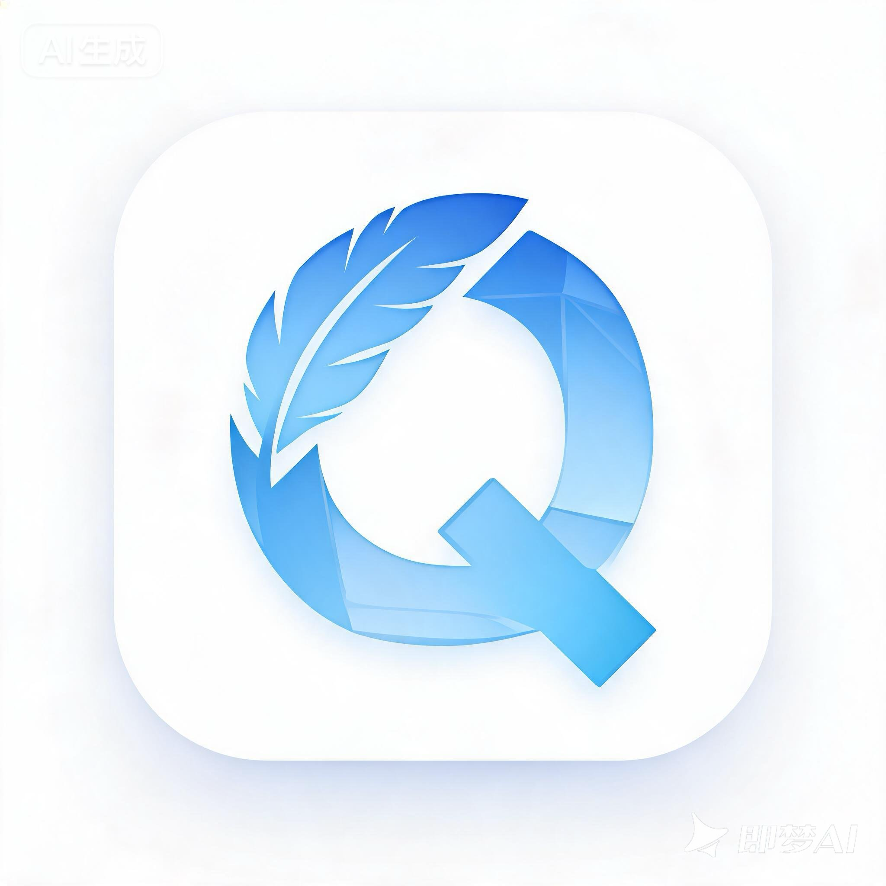

<p align="center">
  
</p>

<h1 align="center">轻记 / QingNote</h1>

<p align="center">
  <b>一套代码，五端运行 — Flutter + Rust 驱动的全平台智能笔记</b>
</p>

<p align="center">
  
  
  
  
  
</p>

<p align="center">
  
  
  
  
  
</p>

---

## 为什么选择 QingNote？

> 市面上的笔记应用要么功能强大但体积臃肿，要么轻巧但功能单一。QingNote 追求**恰到好处** — 用 Flutter 统一五端 UI 体验，用 Rust 在性能关键路径上做到极致。

| 特性 | 说明 |
|:---|:---|
| **真正的全平台** | 一套 Dart 代码覆盖 Android / iOS / macOS / Windows / **HarmonyOS NEXT**，包含鸿蒙原生适配 |
| **Block Editor** | 基于 appflowy_editor 的树状 Node 文档模型，媲美 Notion 的编辑体验 |
| **Rust 全文检索** | tantivy 倒排索引 + jieba 中文分词，毫秒级搜索 + 高亮片段 |
| **离线优先** | 所有数据存储在本地 SQLite，无需联网，隐私安全 |

---

## 核心功能

### 富文本编辑

- **Block 编辑器** — 标题、段落、有序/无序列表、待办清单、引用、分割线、表格
- **行内样式** — 粗体、斜体、下划线、删除线、高亮、文字颜色、链接、对齐
- **Markdown 快捷键** — `# ` 标题、`- ` 列表、`[] ` 清单，实时渲染

### 多媒体

- **图片插入** — 拍照或从相册选取，嵌入笔记正文
- **录音笔记** — 内置录音器 + 播放器，适合会议记录
- **手写涂鸦** — 画板 + 贝塞尔曲线平滑笔迹

### 组织管理

- **文件夹 / 笔记本** — 两级分类，灵活管理
- **待办清单** — 独立待办页面，支持定时提醒通知
- **收藏 & 回收站** — 一键收藏，回收站 30 天自动清理

### 搜索 & 体验

- **全文检索** — Rust 实现的中文分词 + 倒排索引，搜索结果带高亮片段
- **深色模式** — 跟随系统或手动切换
- **响应式布局** — 移动端底栏导航，桌面端侧栏三栏布局

---

## 平台支持

| 平台 | 框架 | 最低版本 | 构建产物 | 状态 |
|:---:|:---:|:---:|:---:|:---:|
| Android | Flutter | API 24 (7.0) | APK / AAB | ✅ |
| iOS | Flutter | iOS 13+ | .ipa | ✅ |
| macOS | Flutter Desktop | macOS 11+ | .app | ✅ |
| Windows | Flutter Desktop | Windows 10+ | MSIX / exe | ✅ |
| HarmonyOS NEXT | CPF-Flutter | API 12+ (5.0) | .hap | ✅ |

---

## 架构设计

### 五层分层架构

```
                    ┌─────────────────────────────────────────────┐
                    │          Layer 1 · 表现层 (Flutter)          │
                    │   appflowy_editor · 业务页面 · 平台适配      │
                    ├─────────────────────────────────────────────┤
                    │          Layer 2 · 业务逻辑层 (Dart)         │
                    │  NoteRepo · TodoRepo · FolderRepo · Services│
                    ├─────────────────────────────────────────────┤
                    │         Layer 3 · 持久化层 (Dart)            │
                    │      sqflite (SQLite) · dart:io (文件)       │
                    ├──────── flutter_rust_bridge (FFI) ──────────┤
                    │          Layer 4 · Rust 扩展层               │
                    │    tantivy 全文检索 · jieba-rs 中文分词      │
                    ├─────────────────────────────────────────────┤
                    │        Layer 5 · 云端同步 (规划中)            │
                    │       Rust 后端 · CRDT 增量同步              │
                    └─────────────────────────────────────────────┘
```

### Flutter ↔ Rust 职责划分

| 模块 | 归属 | 选择理由 |
|:---|:---:|:---|
| 文档编辑 (Operation / Undo / Redo) | **Dart** | appflowy_editor 内置，16ms 渲染帧内闭环 |
| 笔记 / 文件夹 / 待办 CRUD | **Dart** | sqflite 标准 CRUD，无需跨语言开销 |
| 文件存储 / 录音 / 拍照 / 分享 | **Dart** | Flutter 插件生态成熟 |
| 全文搜索索引 | **Rust** | 中文分词 + 倒排索引，Dart 无成熟方案 |

### 数据流

```
编辑笔记  用户输入 → appflowy_editor Document → Repository.save()
         → sqflite 持久化 → FRB 桥接 → Rust tantivy 建立索引

搜索笔记  搜索词 → FRB → Rust tantivy 查询 → 返回 ID + 高亮片段
         → Dart sqflite 按 ID 加载完整笔记
```

---

## 技术栈

| 类别 | 技术选型 |
|:---|:---|
| 跨平台框架 | Flutter 3.27+ / CPF-Flutter (鸿蒙) |
| Block Editor | appflowy_editor |
| 状态管理 | Riverpod |
| 路由导航 | go_router (StatefulShellRoute) |
| 本地数据库 | sqflite (SQLite) |
| Rust 桥接 | flutter_rust_bridge v2 |
| 全文检索 | tantivy 0.22 + jieba-rs 0.7 |
| 音频 | record + audio_players |
| 图片 | image_picker |
| 桌面窗口 | window_manager |

---

## 项目结构

```
QingNote/
├── lib/
│   ├── main.dart                  # 应用入口
│   ├── router.dart                # go_router 路由配置
│   ├── theme.dart                 # 主题系统 (亮色/暗色)
│   ├── models/                    # 数据模型
│   ├── db/                        # SQLite 数据库 & 迁移
│   ├── repositories/              # Repository 数据访问层
│   ├── providers/                 # Riverpod 状态管理
│   ├── pages/                     # 页面 (列表/编辑器/待办/设置)
│   ├── widgets/                   # 可复用组件
│   ├── services/                  # 平台服务 (搜索/通知/文件)
│   └── src/rust/                  # FRB 生成的 Dart 绑定
├── rust/                          # Rust 工作区
│   └── src/
│       ├── api/search.rs          # FRB 暴露的搜索 API
│       └── search/
│           ├── indexer.rs         # tantivy 索引管理
│           ├── searcher.rs        # 搜索引擎 + 高亮
│           └── tokenizer.rs      # jieba 中文分词器
├── android/                       # Android 平台配置
├── ios/                           # iOS 平台配置
├── macos/                         # macOS Desktop 配置
├── windows/                       # Windows Desktop 配置
└── ohos/                          # HarmonyOS NEXT 配置
```

---

## 快速开始

### 环境要求

- [Flutter SDK](https://flutter.dev/docs/get-started/install) 3.27+
- [Rust 工具链](https://rustup.rs/) (stable)
- `flutter_rust_bridge_codegen` — `cargo install flutter_rust_bridge_codegen`
- 鸿蒙端额外需要 [OHOS Flutter SDK (CPF-Flutter)](https://gitee.com/aspect-aspect/aspect-aspect)

### 克隆 & 运行

```bash
git clone https://github.com/fanshanhong/QingNote.git
cd QingNote/code/HuaweiNoteFlutter
```

```bash
# Android
flutter run -d <android-device-id>

# iOS
flutter run -d <ios-device-id>

# macOS
flutter run -d macos

# Windows
flutter run -d windows

# HarmonyOS NEXT
flutter build hap
```

### Rust 搜索引擎单元测试

```bash
cd rust
cargo test
```

---

## 设计理念

**为什么选 Flutter + Rust？**

- **Flutter** 解决 UI 一致性 — 一套代码覆盖五端，无需为每个平台维护独立 UI 层
- **Rust** 解决性能瓶颈 — 全文检索需要中文分词 + 倒排索引，Dart 生态无成熟方案；Rust 的 tantivy + jieba-rs 提供工业级检索能力
- **flutter_rust_bridge** 解决胶水层 — 零拷贝 FFI 调用，Dart 侧完全类型安全，无需手写 C 绑定

**为什么不用 Compose Multiplatform / KMP？**

QingNote 需要覆盖 HarmonyOS NEXT（鸿蒙）。截至 2026 年，Flutter 是唯一通过 CPF 适配方案同时支持 Android / iOS / macOS / Windows / HarmonyOS NEXT 的跨平台框架。

---

## 路线图

- [x] 富文本 Block Editor
- [x] 全文检索 (Rust tantivy + jieba)
- [x] 五端构建验证
- [x] 手写涂鸦
- [x] 深色模式
- [ ] CRDT 协同编辑 (Yrs)
- [ ] 云端同步 (Rust 后端)
- [ ] AI 辅助写作
- [ ] 插件系统

---

## 许可证

本项目使用的 appflowy_editor 遵循 [MPL-2.0](https://www.mozilla.org/en-US/MPL/2.0/) 许可证。

---

<p align="center">
  <sub>Built with Flutter + Rust by <a href="https://github.com/fanshanhong">@fanshanhong</a></sub>
</p>
